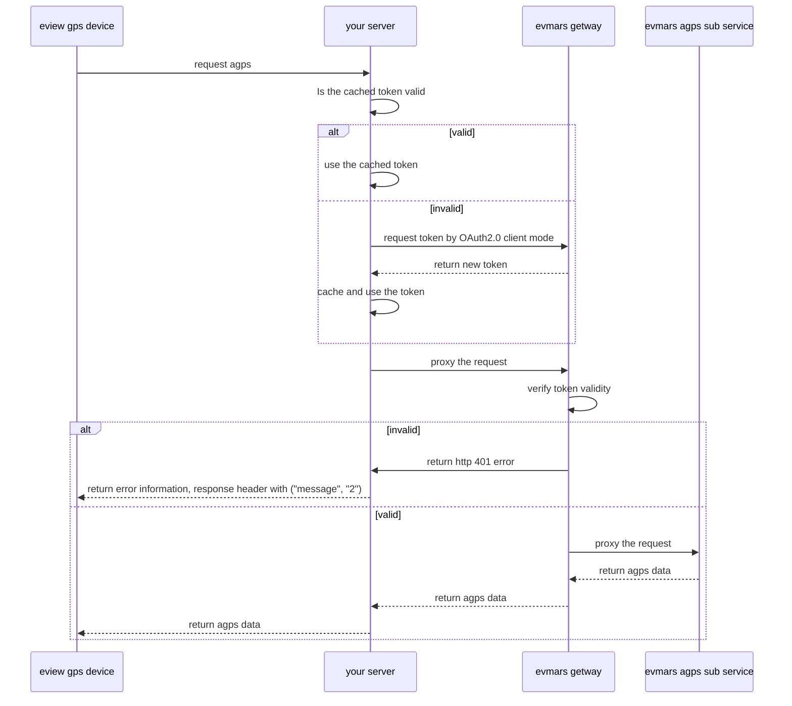

```mermaid

sequenceDiagram

participant device as eview gps device
participant customerServer as your server
participant evmarBizServer as evmars getway
participant agpsServer as evmars agps sub service


device ->> customerServer: request agps
customerServer ->> customerServer: Is the cached token valid
alt valid
     customerServer ->> customerServer: use the cached token
else invalid
     customerServer ->> evmarBizServer: request token by OAuth2.0 client mode
     evmarBizServer -->> customerServer: return new token
     customerServer ->> customerServer: cache and use the token
end
customerServer ->> evmarBizServer: proxy the request
evmarBizServer ->> evmarBizServer: verify token validity
alt invalid
     evmarBizServer ->> customerServer: return http 401 error
     customerServer -->> device: return error information, response header with ("message", "2");
else valid
     evmarBizServer ->> agpsServer: proxy the request
     agpsServer -->> evmarBizServer:  return agps data
     evmarBizServer -->> customerServer: return agps data
     customerServer -->> device: return agps data
end

```
