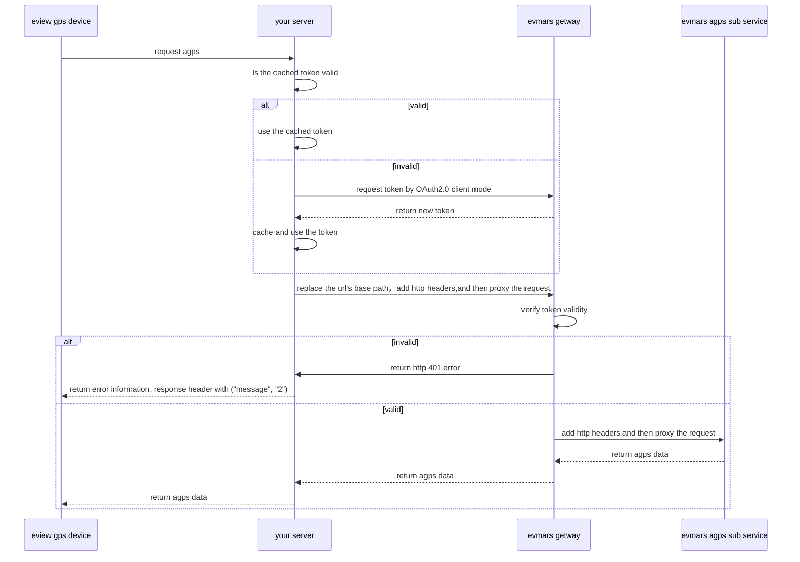

### Timing diagram

The following figure does not specify the expiration verification steps of the token, so please design it yourself



### How to get tokens

Please refer to [Oauth2.0](../oauth/README.md)

● client_secret_basic

The parameter passing method is to concatenate the clientId and clientSecret with the ':' sign and encode it with Base64 to obtain a string of characters. Put this encoded string in the Authorization header to send the request.

#### client_secret_basic

```
POST {{host}}/admin/oauth2/token?grant_type=client_credentials
Authorization:Basic {{Base64(clientId:clientSecret)}}
```

### Replace the base path in the URL

If the device requests the URL of your server: `http://your-domain/url?url=xxxxxxxxxxxx`
You need to change the URL to: `http://eview-domain/admin/agps/url?url=xxxxxxxxxxxx`

Namely: replace `http://your-domain` with `http://eview-domain/admin/agps`

Of course, `eview-domain` is not an actual domain name, you need to contact the business staff to obtain it


### X-Base-Path instructions

X-Base-Path is the interface path that you expose, such as http://your-domain

```
Authorization: Bearer {{Token}}
X-Base-Path: http://www.your-domain.com
```


