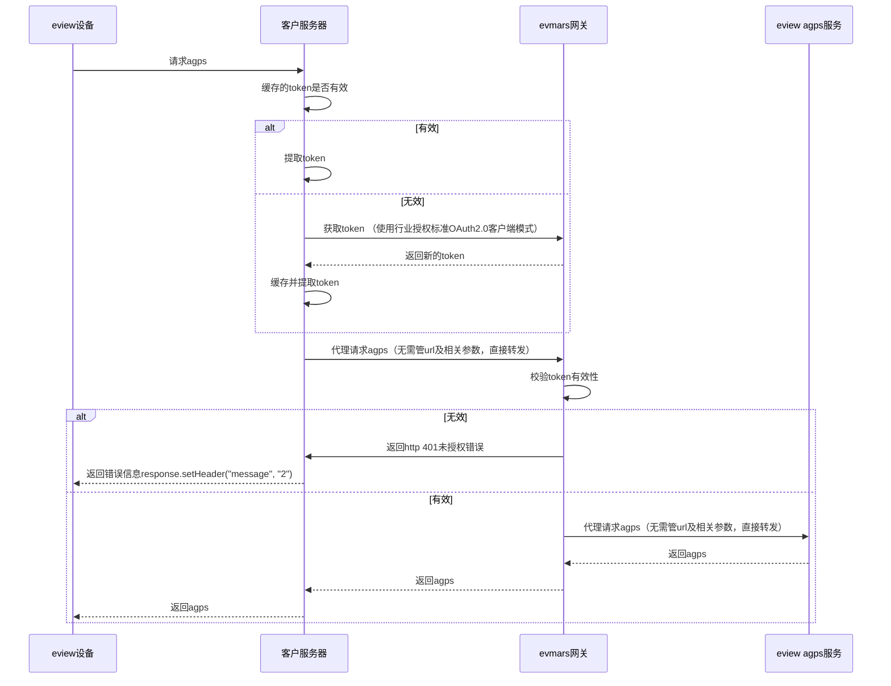

```mermaid

sequenceDiagram

participant device as eview设备
participant customerServer as 客户服务器
participant evmarBizServer as evmars网关
participant agpsServer as eview agps服务


device ->> customerServer: 请求agps
customerServer ->> customerServer: 缓存的token是否有效
alt 有效
     customerServer ->> customerServer: 提取token
else 无效
     customerServer ->> evmarBizServer: 获取token （使用行业授权标准OAuth2.0客户端模式）
     evmarBizServer -->> customerServer: 返回新的token
     customerServer ->> customerServer: 缓存并提取token
end
customerServer ->> evmarBizServer: 代理请求agps（无需管url及相关参数，直接转发）
evmarBizServer ->> evmarBizServer: 校验token有效性
alt 无效
     evmarBizServer ->> customerServer: 返回http 401未授权错误
     customerServer -->> device: 返回错误信息response.setHeader("message", "2");
else 有效
     evmarBizServer ->> agpsServer: 代理请求agps（无需管url及相关参数，直接转发）
     agpsServer -->> evmarBizServer:  返回agps
     evmarBizServer -->> customerServer: 返回agps
     customerServer -->> device: 返回agps
end

```
