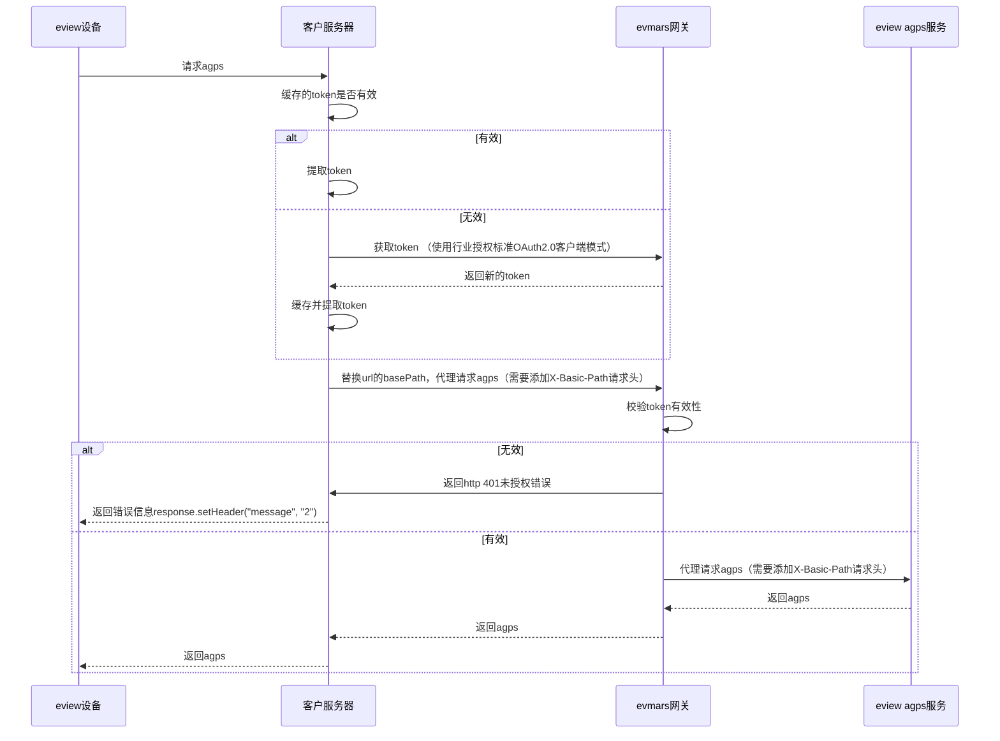

### 时序图

下图未明确token的过期校验步骤，请自行设计



### Token获取方式

请参考 [Oauth2.0](../oauth/README.md)

`client_secret_basic` 传参方式是将 clientId 和 clientSecret 通过 ‘:’ 号拼接，并使用 Base64 进行编码得到一串字符。将此编码字符串放到请求头(Authorization)去发送请求。
#### client_secret_basic

```
POST {{host}}/admin/oauth2/token?grant_type=client_credentials
Authorization:Basic {{Base64(clientId:clientSecret)}}
```

### 替换Url中的base path

若设备请求您的服务器的url为：`http://your-domain/url?url=xxxxxxxxxxxx`
您需要将url修改为：`http://eview-domain/admin/agps/url?url=xxxxxxxxxxxx`

即：将`http://your-domain`替换为`http://eview-domain/admin/agps`

当然，`eview-domain`并不是实际的域名，需要联系业务人员获取

### X-Base-Path说明

X-Base-Path为您对外公开的接口路径，如： http://your-domain

```
Authorization: Bearer {{Token}}
X-Base-Path: http://www.your-domain.com
```
