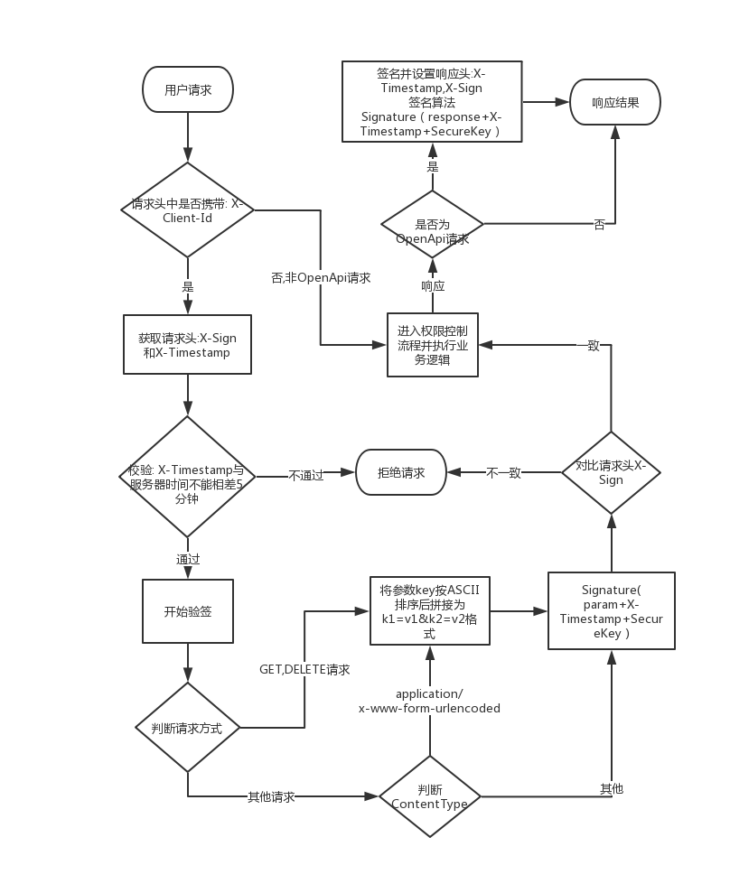

## 调用OpenApi
### 使用签名的方式
#### 验证流程



::: tip 说明

1. 图中`Signature`函数为客户端设置的签名方式,支持`MD5`和`Sha256`.
2. 发起请求的签名信息都需要放到请求头中,而不是请求体.

:::

#### 签名

平台使用签名来校验客户端请求的完整性以及合法性.

例:

ClientId为`testId`,
SecureKey为:`testSecure`.
客户端请求接口: `/api/v1/device/dev0001/log/_query`,参数为`pageSize=20&pageIndex=0`,签名方式为`md5`.

1. 将参数key按ascii排序得到: pageIndex=0&pageSize=20
2. 使用拼接时间戳以及密钥得到: pageIndex=0&pageSize=201574993804802testSecure
3. 使用`md5("pageIndex=0&pageSize=201574993804802testSecure")`得到`837fe7fa29e7a5e4852d447578269523`

示例:

```text
GET /api/device?pageIndex=0&pageSize=20
X-Client-Id: testId
X-Timestamp: 1574993804802
X-Sign: 837fe7fa29e7a5e4852d447578269523
```

响应结果:

```text
HTTP/1.1 200 OK
X-Timestamp: 1574994269075
X-Sign: c23faa3c46784ada64423a8bba433f25

{"status":200,result:[]}

```

#### 验签

使用和签名相同的算法(不需要对响应结果排序):

```java

String secureKey = ...; //密钥
String responseBody = ...;//服务端响应结果
String timestampHeader = ...;//响应头: X-Timestamp
String signHeader = ...; //响应头: X-Sign

String sign = DigestUtils.md5Hex(responseBody+timestampHeader+secureKey);
if(sign.equalsIgnoreCase(signHeader)){
    //验签通过

}

```

### 使用token的方式

通过请求接口`/api/v1/token`来获取`X-Access-Token`，之后可以使用此token来发起api请求。

### 申请token
客户端请求接口`/api/v1/token`  
    请求方式： POST  

```text

POST /api/v1/token
X-Sign: 932bbe8a39ae03f568f73a507d87afac
X-Timestamp: 1587719082698 
X-Client-Id: kF**********HRZ  
Content-Type: application/json 

{  
    "expires": 7200 // 过期时间,单位秒.
}

//返回

{
    "status":200,
    "result":"3bcddb719b01da679b88d07acde2516" //token信息
}

```

### 使用token发起请求 

此处以获取设备123456789012345详情为例。  

```text
GET /api/v1/device/test001/_detail  
X-Access-Token: 3bcddb719b01da679b88d07acde2516  
```

响应结果：

```json
{
    "result": {
        "id": "123456789012345",
        "name": "测试设备",
        "protocol": "evgps",
        "transport": "TCP",
        "orgId": "test",
        "productId": "katchu",
        "productName": "katchu",
        "deviceType": {
            "text": "直连设备",
            "value": "device"
        },
        "state": {
            "text": "离线",
            "value": "offline"
        },
        "address": "/127.0.0.1:36982",
        "onlineTime": 1681456206013,
        "offlineTime": 1681456528230,
        "createTime": 1672124830209,
        "registerTime": 1672124833132,
        "metadata": "{物模型内容在此省略……}",
        "configuration": {
            "isDebug": "true",
            "parseType": "",
            "isChina": "false",
            "isDelayMsg": "true",
            "isHexLog": "false",
            "trackerType": "katchu",
            "isIgnoreEvLog": "false"
        },
        "tags": []
    },
    "status": 200,
    "code": "success"
}
```


### OAuth2.0

平台也支持通过OAuth2.0进行认证,支持: `authorization_code`和`client_credentials`以及`refresh_token`.

+ 授权地址: http://{domain}/#/user/login
+ client_id: 第三方平台中配置的clientId
+ ClientSecret: 第三方平台中配置的secureKey
+ Token地址: http://{domain}/loctube/oauth2/token

例如:

```js
POST /loctube/oauth2/token
Content-Type: application/json

{
    "grant_type": "client_credentials", //固定client_credentials
    "client_id":"client_id",            
    "client_secret":"client_secret",
}

响应:

{
    "access_token":"access_token",
    "refresh_token":"refresh_token",
    "expires_in":7200 //有效期,单位秒
}
```

使用token请求接口:

```js
POST /device/instance/_query
Authorization: bearer access_token

{}
```

或者
```js
POST /device/instance/_query?access_token=access_token
 
{}
```