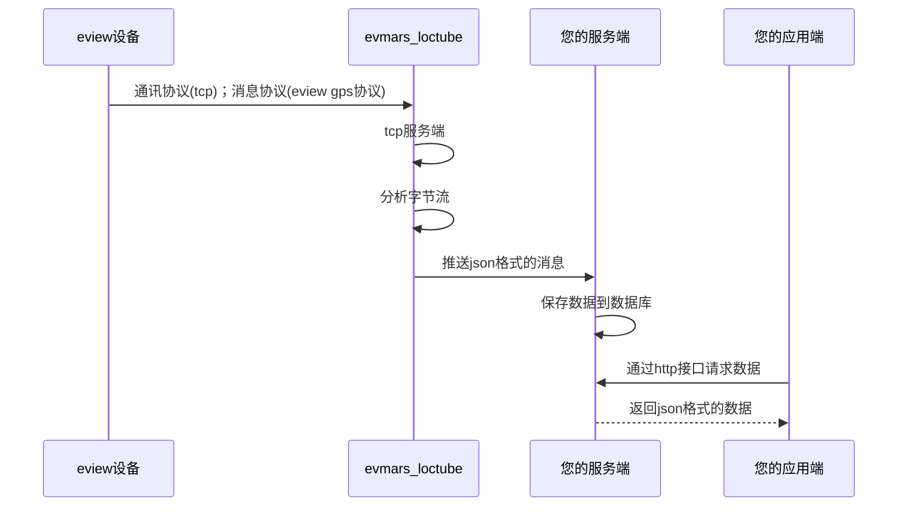

```mermaid

sequenceDiagram

    participant device as eview设备
    participant loctube as evmars_loctube
    participant server as 您的服务端
    participant app as 您的应用端

    device ->> loctube: 通讯协议(tcp)；消息协议(eview gps协议)
    loctube ->> loctube: tcp服务端
    loctube ->> loctube: 分析字节流
    loctube ->> server : 推送json格式的消息
    server ->> server: 保存数据到数据库
    app ->> server : 通过http接口请求数据
    server -->> app: 返回json格式的数据

```