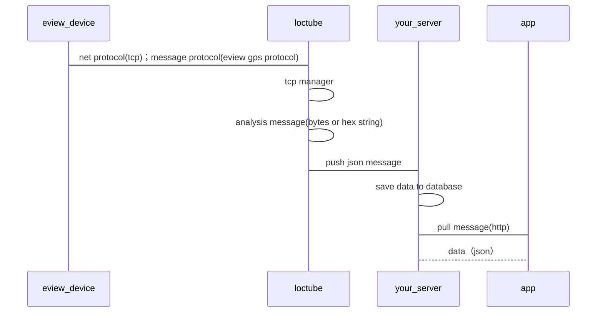

```mermaid

sequenceDiagram

    participant device as eview_device
    participant loctube as loctube
    participant server as your_server

    device -> loctube: net protocol(tcp)；message protocol(eview gps protocol)
    loctube -> loctube: tcp manager
    loctube -> loctube: analysis message(bytes or hex string)
    loctube -> server : push json message
    server -> server: save data to database
    app -> server : pull message(http)
    server --> app: data（json）

```