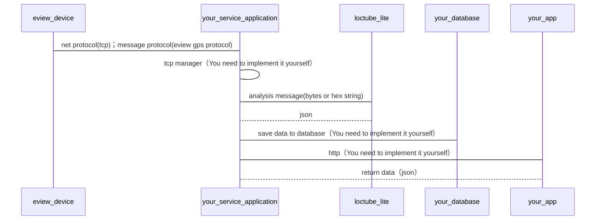

```mermaid

sequenceDiagram

    participant device as eview_device
    participant server as your_service_application
    participant lite as loctube_lite
    participant db as your_database
    participant app as your_app

    device -> server: net protocol(tcp)；message protocol(eview gps protocol)
    server -> server: tcp manager（You need to implement it yourself）
    server -> lite: analysis message(bytes or hex string)
    lite --> server: json
    server -> db: save data to database（You need to implement it yourself）
    app -> server : http（You need to implement it yourself）
    server --> app: return data（json）

```