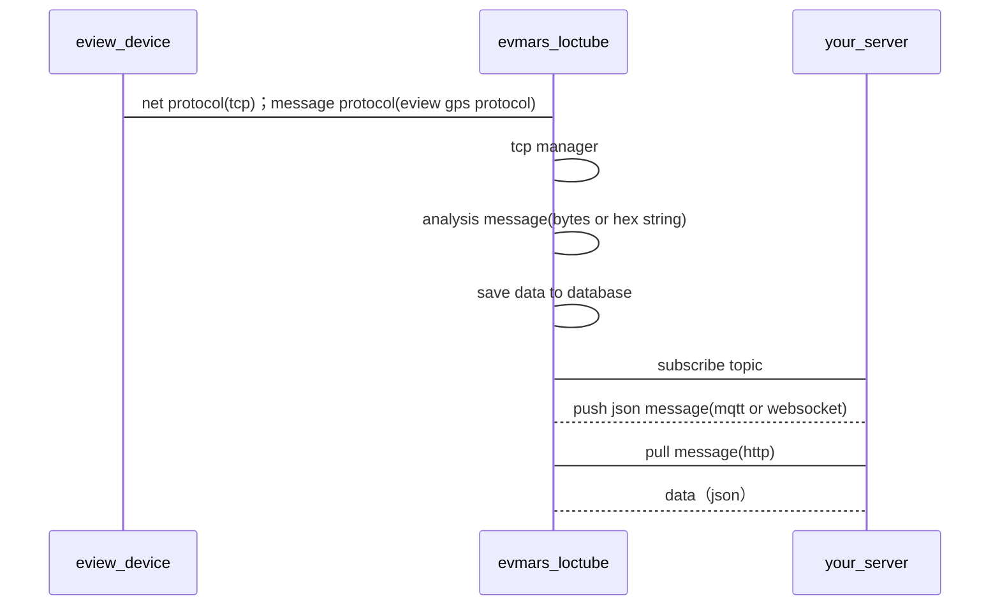

```mermaid

sequenceDiagram

    participant device as eview_device
    participant loctube as evmars_loctube
    participant app as your_server

    device -> loctube: net protocol(tcp)；message protocol(eview gps protocol)
    loctube -> loctube: tcp manager
    loctube -> loctube: analysis message(bytes or hex string)
    loctube -> loctube: save data to database

    app -> loctube : subscribe topic
    loctube --> app : push json message(mqtt or websocket)

    app -> loctube : pull message(http)
    loctube --> app: data（json）

```

```mermaid

    sequenceDiagram
    participant device as eview_device
    participant loctube as evmars_loctube
    participant app as katchu_server

    device -> loctube: net protocol(tcp)；message protocol(eview gps protocol)
    loctube -> loctube: tcp manager
    loctube -> loctube: analysis message(bytes or hex string)
    loctube -> loctube: save data to database

    app -> loctube : subscribe topic
    loctube --> app : push json message(mqtt or websocket)

    app -> loctube : pull message(http)
    loctube --> app: data（json）

```