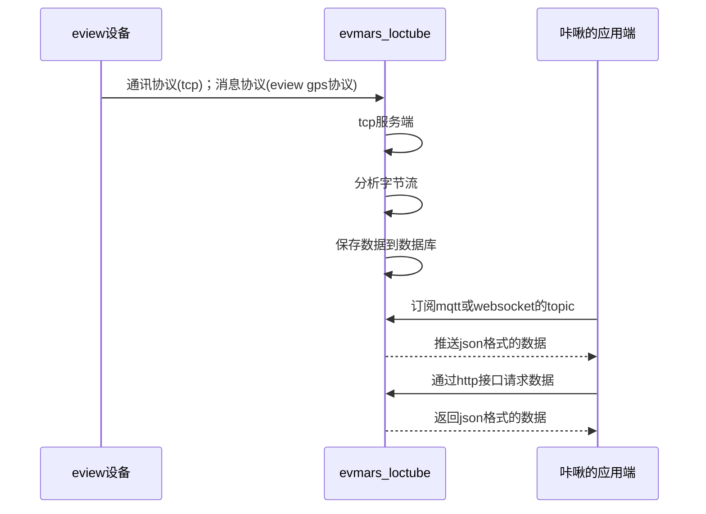

* Evmars-Loctube

```mermaid

sequenceDiagram

    participant device as eview设备
    participant loctube as evmars_loctube
    participant app as 您的应用端

    device ->> loctube: 通讯协议(tcp)；消息协议(eview gps协议)
    loctube ->> loctube: tcp服务端
    loctube ->> loctube: 分析字节流
    loctube ->> loctube: 保存数据到数据库

    app ->> loctube : 订阅mqtt或websocket的topic
    loctube -->> app : 推送json格式的数据

    app ->> loctube : 通过http接口请求数据
    loctube -->> app: 返回json格式的数据

```

* Evmars-Loctube在咔啾（KatchU）的应用场景

```mermaid

    sequenceDiagram
    participant device as eview设备
    participant loctube as evmars_loctube
    participant app as 咔啾的应用端

    device ->> loctube: 通讯协议(tcp)；消息协议(eview gps协议)
    loctube ->> loctube: tcp服务端
    loctube ->> loctube: 分析字节流
    loctube ->> loctube: 保存数据到数据库

    app ->> loctube : 订阅mqtt或websocket的topic
    loctube -->> app : 推送json格式的数据

    app ->> loctube : 通过http接口请求数据
    loctube -->> app: 返回json格式的数据

```