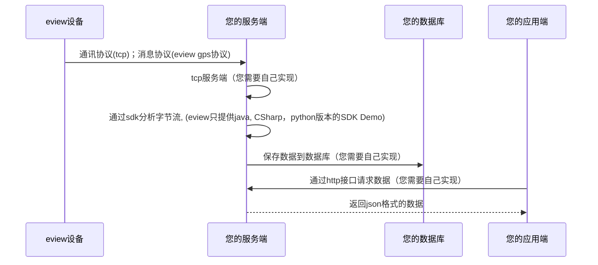

```mermaid

sequenceDiagram

    participant device as eview设备
    participant server as 您的服务端
    participant db as 您的数据库
    participant app as 您的应用端

    device ->> server: 通讯协议(tcp)；消息协议(eview gps协议)
    server ->> server: tcp服务端（您需要自己实现）
    server ->> server: 通过sdk分析字节流, (eview只提供java, CSharp，python版本的SDK Demo)
    server ->> db: 保存数据到数据库（您需要自己实现）
    app ->> server : 通过http接口请求数据（您需要自己实现）
    server -->> app: 返回json格式的数据

```