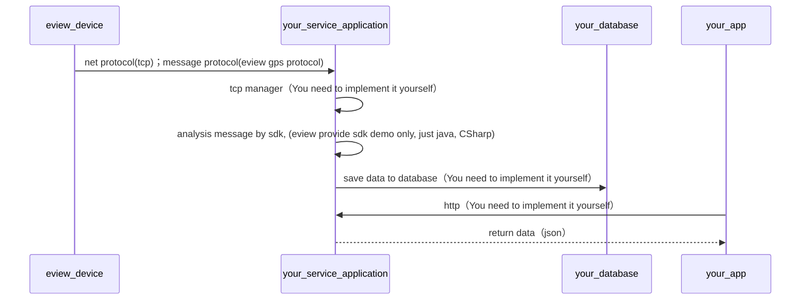

```mermaid

sequenceDiagram

    participant device as eview_device
    participant server as your_service_application
    participant db as your_database
    participant app as your_app

    device ->> server: net protocol(tcp)；message protocol(eview gps protocol)
    server ->> server: tcp manager（You need to implement it yourself）
    server ->> server: analysis message by sdk, (eview provide sdk demo only, just java, CSharp)
    server ->> db: save data to database（You need to implement it yourself）
    app ->> server : http（You need to implement it yourself）
    server -->> app: return data（json）

```