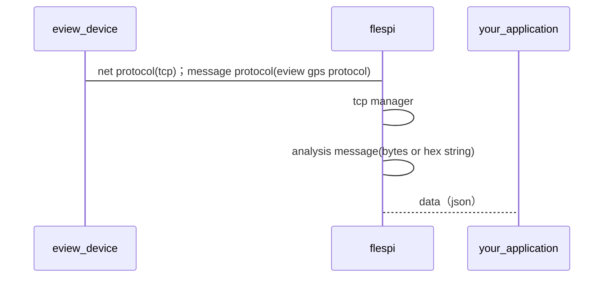

```mermaid

sequenceDiagram

    participant device as eview_device
    participant flespi as flespi
    participant app as your_application

    device -> flespi: net protocol(tcp)；message protocol(eview gps protocol)
    flespi -> flespi: tcp manager
    flespi -> flespi: analysis message(bytes or hex string)
    flespi --> app: data（json）

```