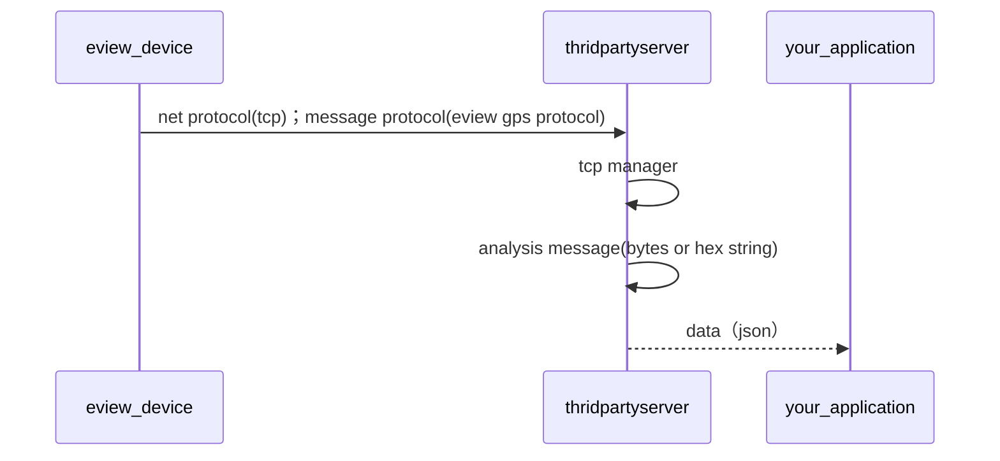

```mermaid

sequenceDiagram

    participant device as eview_device
    participant thridpartyserver as thridpartyserver
    participant app as your_application

    device ->> thridpartyserver: net protocol(tcp)；message protocol(eview gps protocol)
    thridpartyserver ->> thridpartyserver: tcp manager
    thridpartyserver ->> thridpartyserver: analysis message(bytes or hex string)
    thridpartyserver -->> app: data（json）

```